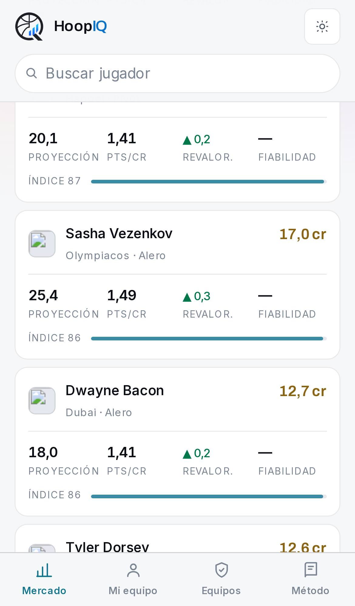
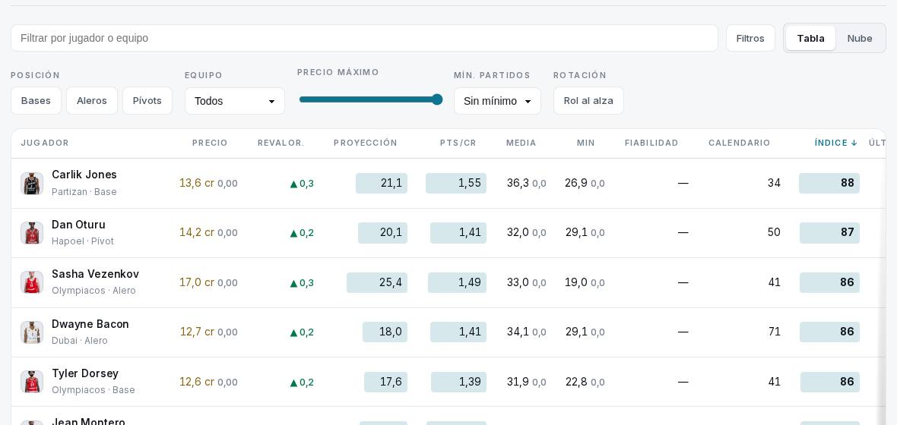
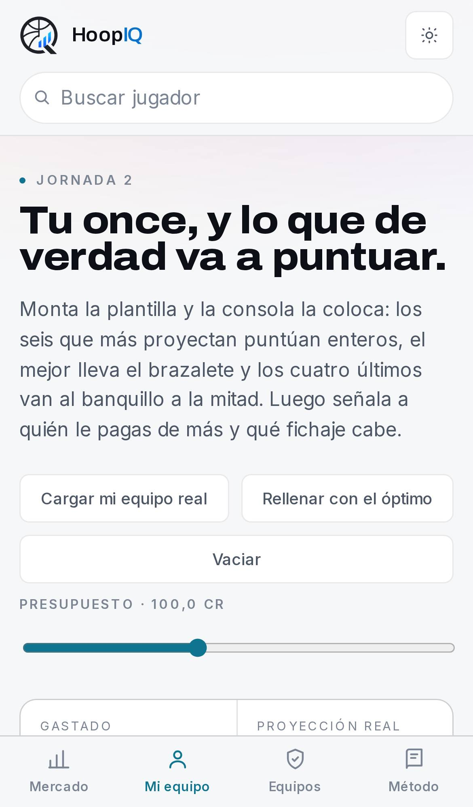
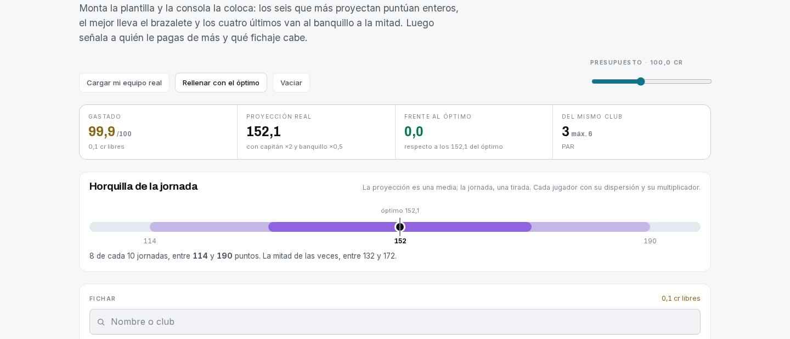
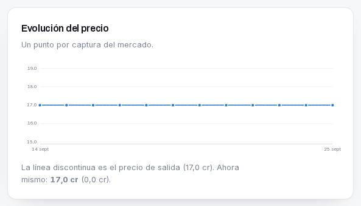
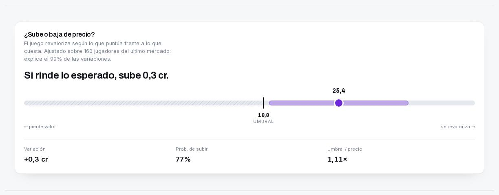

# Auditoría de HoopIQ, 26 de septiembre de 2026

Web: https://euroleague-fantasy-analytics.vercel.app, a la que se llega después de la Jornada 1 y antes de la Jornada 2.
Código revisado: `main` en `d60416b` ("Capa avanzada, lesiones y buscador en Mi equipo", 26-09 10:35 UTC), que es el commit que despliega Vercel.

> **Cómo se ha hecho y qué límites tiene.** La web se recorrió dos veces con Playwright/Chromium a
> 1440×900 y en iPhone 13 (390×844 @3x), pasando axe-core (WCAG 2 A/AA) y midiendo CLS, LCP y peso:
> 1. **En local**, compilada (`npm run build` + `next start`) desde el mismo commit que está en producción.
>    En ese momento la red del entorno bloqueaba el dominio de Vercel.
> 2. **En producción** (https://euroleague-fantasy-analytics.vercel.app), a las 11:35 UTC del 26-09, una vez
>    abierto el acceso. Los resultados coinciden: mismos fallos de axe con idénticos recuentos por página,
>    CLS 0 (0,015 en la primera carga de la portada), y los mismos precios y textos. Producción sirve los
>    datos generados el 26-09 a las 10:35, con 12 capturas de precio.
>
> Las capturas de este informe son de producción. Lo que **no** se ha podido consultar son los precios
> que tiene ahora mismo el juego: `fantaking-api.dunkest.com` responde, pero exige token (401) y el
> entorno no tiene `FANTAKING_TOKEN`. El bug de créditos se ha diagnosticado con el histórico versionado
> en `data/raw/prices/`, el calendario oficial, el historial de GitHub Actions y la web en producción.

---

## 1. Resumen ejecutivo

- **Bug de créditos: confirmado, y no está en el juego.** Los 12 snapshots de precios guardados
  (14-09 → 25-09) tienen **las 350 cotizaciones idénticas**: 0 cambios en 11 transiciones. El último es del
  **25-09 a las 12:34 UTC**, 4 h 26 min antes de que empezara el segundo día de la J1 (BES-PAM, ULK-VIR,
  PAR-MIL, de 17:00 a 20:45 UTC). **Desde que terminó la J1 no se ha capturado ningún precio.** Esta mañana
  se regeneró la web a mano (26-09 10:35 UTC, `d60416b`) con la J1 completa en estadísticas pero con ese
  snapshot viejo. El resultado es una web que dice "Jornada 2" y enseña precios anteriores a la J1.
  El juego ya había publicado la variación (`plus`) para 207 jugadores, pero la web no la muestra en ninguna parte.
- **Tiene consecuencias.** El "equipo óptimo con 100 cr" (99,9 cr hoy) costaría **~104,0 cr** con los
  precios post-J1 estimados. Se recomienda a los usuarios una plantilla que no pueden fichar.
  **Confirmado a las 11:54 UTC con una captura nueva:** 287 precios cambiados, los 207 del jueves en
  exactamente su `plus`, y el óptimo anterior cuesta en realidad 104,1 cr (§6.6). Esa ejecución sacó a la
  luz un segundo fallo, un óptimo publicado **sin entrenador** por PuLP 4.0 más un error de redondeo
  (§6.7). El arreglo está en la rama.
- **Proyección: la metodología publicada se corresponde en lo esencial con el código, pero se deja
  fuera tres mecanismos, y dos de sus piezas empeoran la predicción.** En un backtest paso a paso sobre la
  temporada 2025-26 (7.764 predicciones), la media simple de temporada (MAE 6,05) gana a la mezcla con
  forma de 5 partidos (6,11) y a la mezcla con ajuste de minutos que usa la web (6,27). Lo que más ayuda
  al principio de temporada es encoger hacia la media, algo que el código ya hace con la temporada
  anterior: con 1-3 partidos, MAE de 6,64 a 6,16.
- **UX: el flujo Mercado → Mi equipo no existe.** Ni en el mercado ni en la ficha hay un botón "Fichar".
  La portada no tiene ninguna llamada a la acción en la primera pantalla. Las reglas del juego no se
  explican en ningún sitio antes de que el usuario empiece a decidir.
- **Diseño sólido, con dos fallos sistémicos.** El gris secundario del tema claro (`#7b8493`) no llega a
  AA: **3,52:1**, entre 39 y 165 nodos por página. Además, **todas** las páginas cargan un chunk JS de
  702 KB (96 KB gz) con el `players.json` completo, por el buscador de la cabecera. CLS = 0 en todas.

---

## 2. Diseño y UI

### Lo que funciona
- **El sistema es coherente.** Hay una tipografía (Archivo variable), un acento cian, cifras tabulares
  (`.num`) en todas las tablas y la misma jerarquía en todas las páginas: eyebrow, H1 grande, lede
  y tarjetas. El precio siempre va en ocre (`13,6 cr`) y la proyección siempre en negrita, así que se
  aprende una vez y vale para toda la web.
- **El responsive está bien resuelto.** En mobile la tabla del explorador se convierte en tarjetas
  (proyección, pts/cr, revalorización, fiabilidad y barra de índice), no hay scroll horizontal en
  ninguna página y hay navegación inferior fija con 4 destinos.
  
- **Estabilidad visual: CLS = 0,000 en las 14 combinaciones de página y viewport.** El póster de la
  portada tiene `width`/`height` y es el primer fotograma del vídeo, así que no hay salto.
- **Accesibilidad de base:** hay *skip link* ("Saltar al contenido"), `:focus-visible` con outline de 2 px en
  enlaces y botones, todas las `` tienen `alt` (decorativo `""` cuando el nombre va al lado), el
  vídeo de fondo se puede pausar (WCAG 2.2.2) y respeta `prefers-reduced-motion` y `saveData`.
- **Estados vacíos:** el explorador enseña "Ningún jugador cumple esos filtros" y la ficha de precio
  tiene un estado para "única captura".

### Problemas

| # | Hallazgo | Evidencia | Severidad |
|---|---|---|---|
| D1 | **Contraste insuficiente del texto secundario en tema claro.** `--ink-muted: #7b8493` se usa tal cual en claro y en oscuro (`globals.css:86` y `:124`). Da 3,52:1 sobre `#f6f7f9`, 3,77:1 sobre blanco y 2,85:1 sobre el chip lila `#e4dcf5`, con cuerpos de texto de 9,6 a 13 px. | axe `color-contrast` (serious): 74 nodos en /mercado desktop, 165 en /mercado mobile, 156 en /equipos, 96 en la ficha. | Alta |
| D2 | **Todas las páginas descargan el mercado entero en JS.** `lib/search-index.ts` importa `lib/data.ts`, que importa `players.json` (688 KB). El comentario dice "unos 12 KB", pero el bundler no puede quitar campos de un JSON y mete el fichero completo en el chunk compartido `2mf8auxddzmc_.js` (**702 KB, 96 KB gz**). Pasa también en /metodologia. | `grep -c fpFloor` en el chunk da 350 apariciones. | Media |
| D3 | **HTML muy pesado en /mercado (779 KB, 99 KB gz) y /mi-equipo (639 KB).** Se serializa en el payload RSC el array completo de jugadores y `details` para los componentes cliente. | `curl localhost:3000/mercado \| wc -c` | Media |
| D4 | **Deltas en 0 en cada fila.** "13,6 cr **0,00**", "Media 36,3 **0,0**", "Min 26,9 **0,0**" aparecen en las 330 filas. Con una jornada (y con el bug de §6) es ruido visual que además da a entender que el precio "no se ha movido". |  | Media |
| D5 | **La tabla desborda a 1440 px:** 1186 px de tabla en un contenedor de 1150. La columna "Últimos" queda cortada y necesita scroll horizontal en un monitor normal. | `scrollWidth 1186 > clientWidth 1150` | Baja |
| D6 | **Si falla la CDN, se ve la imagen rota.** Los avatares (`primitives.tsx:83`, `SquadSearch.tsx:347`) no tienen `onError` ni iniciales de repuesto. En la cancha de Mi equipo el hueco se nota mucho. En producción las CDNs cargan (0 imágenes rotas), así que es un riesgo, no un fallo actual. | Recorrido local con la CDN bloqueada. | Baja |
| D7 | **Marcado `<dl>` inválido:** tiene como hijos directos `div > small` / `div > span` en la ficha (`.ficha-band-grid`, `.court-facts`), en Mi equipo y en la ficha de club (`.eq-factors`). | axe `definition-list` (serious) | Baja |
| D8 | **En mobile las tablas de /metodologia hacen scroll pero no reciben foco.** La del baremo mide 514 px dentro de 324 px y `.table-wrap` no tiene `tabIndex=0`, así que con teclado no se puede desplazar. | axe `scrollable-region-focusable` | Baja |
| D9 | **Zonas táctiles pequeñas:** los nombres de la plantilla en /equipos/[code] (52 enlaces de 20 px de alto, "Hall" 22×20), los códigos de rival en /equipos (18 px de alto) y "Cómo se calcula" (15 px). WCAG 2.5.8 pide 24×24 como mínimo y conviene llegar a 44. | Medición en iPhone 13 | Baja |
| D10 | **En mobile la interfaz fija se come un 26 % de la pantalla:** unos 170 px de cabecera (logo más buscador en su propia fila) y unos 90 px de barra inferior de 844. Además, en mobile desaparece el indicador "Jornada 2/38". |  | Baja |
| D11 | **Cambio de tema brusco:** la portada es siempre oscura y al pulsar "Mercado" se pasa a una interfaz clara. La decisión está documentada, pero el salto se nota. | `Portada.tsx` (comentario inicial) | Cosmético |
| D12 | **El campo de búsqueda de la cabecera tiene `outline: none` al recibir foco.** Compensa cambiando el borde (`.search-input:focus`), pero con poco contraste. Conviene comprobarlo con `:focus-visible`. | Recorrido con Tab | Cosmético |

Arreglo de D1, de una línea en el bloque claro de `globals.css`:

```css
/* 5,24:1 sobre #f6f7f9 · 5,62:1 sobre blanco · 5,05:1 sobre #f1f3f6 */
--ink-muted: #5f6878;
```

Arreglo de D2: generar en el pipeline un `search-index.json` con los 5 campos que usa el buscador
(`id, name, club, position, haystack`) e importar **solo ese** fichero desde `search-index.ts`. Así se pasa
de 96 KB gz a unos 8 KB gz en cada página.

---

## 3. Experiencia de usuario

### Los primeros 5 segundos


El titular ("Gana la jornada antes de que se juegue.") tiene fuerza, pero **no dice qué es la web ni
qué se hace en ella**. En la primera pantalla solo hay un botón, el de pausar el vídeo; los botones de
entrada se quitaron a propósito (`Portada.tsx`: "los botones de entrada y el 'Baja' sobraban"). En
mobile la portada ocupa unos **4.800 px CSS de scroll** repartidos en 6 "tiempos", y los enlaces a
Mercado, Mi equipo y Equipos solo aparecen al final. Quien llega nuevo tiene que adivinar que debe hacer
scroll, o tirar del menú.

- **Recomendación:** mantener el vídeo, pero añadir debajo del subtítulo una frase de valor ("Precios del
  Fantasy + estadísticas oficiales: quién rinde más de lo que cuesta") y dos CTAs: **Ver el mercado** y
  **Montar mi equipo**.

### Flujo Mercado → Mi equipo
- **No hay forma de fichar desde el mercado ni desde la ficha.** El explorador y la ficha solo enlazan a la
  ficha. Para montar un equipo hay que ir a Mi equipo y volver a buscar al jugador en su buscador. La
  plantilla vive en `localStorage["efa-squad"]`, que solo usa `SquadConsole`.
  → Añadir "+ Fichar" en cada fila y tarjeta del explorador y en la ficha, que escriba en ese mismo
  `localStorage`, y una mini-barra fija con "Plantilla 7/11 · 23,4 cr libres".
- **La consola de Mi equipo está bien planteada:** hay contadores por puesto (0/4 · 0/4 · 0/2), "máx. 6
  del mismo club", los créditos libres siempre a la vista, filtros "Para tus huecos", la colocación
  automática en quinteto, sexto y banquillo, la horquilla de la jornada y los recambios que caben. Es la
  mejor pantalla de la web.
  
- **"Cargar mi equipo real" confunde:** la ruta `/api/mi-equipo` usa **un único** `FANTAKING_TOKEN` y
  `EFA_FANTASY_TEAM_ID` de servidor, así que para cualquier visitante carga el equipo del autor, o
  enseña un aviso técnico ("Hacen falta las variables FANTAKING_TOKEN y EFA_FANTASY_TEAM_ID").
  → Ocultar el botón si no está configurado, o llamarlo "Ver el equipo del autor".
- **No modela la regla de 4 cambios por jornada** (`MAX_TRADES_PER_ROUND = 4` está en `config.py` pero no
  se usa en el front). Quien ya tiene equipo necesita "parto de esta plantilla, ¿cuáles son los mejores
  ≤4 cambios?", no un once desde cero.
- **El control de presupuesto no explica para qué sirve.** Tiene sentido porque en el juego el valor
  de la plantilla cambia con las revalorizaciones, pero no se cuenta en ningún sitio.

### Densidad de información y filtros
- En /mercado hay tres bloques antes del explorador (señales, óptimo y explorador), lo que está bien
  para un primer vistazo. El explorador tiene 11 columnas ordenables y filtros de **posición, equipo,
  precio máximo, partidos mínimos y "rol al alza"**, más texto libre y la vista Nube.
- **Faltan estos filtros:** *ocultar lesionados y dudas* (hay 14 bajas y 64 dudas en el parte y siguen
  saliendo en el ranking; Williams-Goss, de baja hasta la J4, tiene índice 79,5), *precio mínimo* (el
  control actual es de un solo extremo), *minutos mínimos*, *próximo rival* o *local/visitante*,
  *sube o baja de precio*, y selección de varios equipos a la vez.
- Se pagina de 20 en 20 ("Mostrar 20 más"): para ver los 330 jugadores hacen falta 16 clics.
- Con teclado hay que pasar por más de 25 elementos (señales y óptimo) antes de llegar a los filtros.
  Ayudaría un ancla "Ir al explorador".

### Velocidad percibida
- En producción (desde un contenedor cloud, sin limitar la red): TTFB de 105 a 210 ms y LCP de 250 a
  410 ms en las páginas internas. La portada tarda **1,2 s de LCP** en la primera carga, con CLS 0,015,
  y 324 ms en la segunda. Todo es estático (SSG) y no hay *spinners*.
- Lo que pesa: la portada transfiere 1,09 MB (vídeo webm de 381 KB o mp4 de 861 KB) y el resto de
  páginas entre 200 y 440 KB por D2 y D3.

### Onboarding y Metodología
- **Las reglas del juego no se explican de forma directa en ningún sitio.** En /metodologia solo aparecen
  en una frase al final de la tarjeta del baremo ("El capitán dobla su puntuación y el banquillo cuenta
  la mitad"). No se dice que hay 100 créditos, que son 4 bases, 4 aleros, 2 pívots y un entrenador, que
  hay un máximo de 6 por club, qué formaciones admite el quinteto, que el sexto hombre puntúa al 100 %, que
  hay un +10 % por victoria, que se permiten 4 cambios por jornada ni cómo funciona la revalorización.
  La portada lo menciona de pasada en los tiempos 2 y 3 del scroll, y Mi equipo lo cuenta en el lede.
  → Poner al principio de /metodologia un bloque "Las reglas en 30 segundos" y enlazarlo desde Mi equipo.
- **El orden de la página no ayuda a decidir:** empieza por las fuentes de datos (API, Fantaking) y el
  cruce de identidades, que al usuario le importan poco, y deja al final lo que sí necesita ("qué
  significa cada columna").
- **No se dice cuándo son los precios.** En /mercado solo aparece "12 capturas de precio" y en el pie
  "Datos generados el 26/9/2026, 10:35:04", lo que **da a entender que los datos son de hoy** cuando los
  precios son del 25-09 12:34 UTC (ver §6).

---

## 4. Evaluación de las estadísticas

### Qué se muestra

| Métrica | Dónde | ¿Sirve para encontrar infravalorados? |
|---|---|---|
| Proyección, Pts/cr (proyección ÷ precio) | Tabla, ficha, consola | **Sí, es la métrica central.** Bien elegida. |
| Índice de chollo (40 % pts/cr · 25 % proyección · 15 % fiabilidad · 10 % tendencia de rol · 10 % presión de precio) | Tabla, "Mejores chollos" | Útil como resumen, pero ver R-S2 y R-S3. |
| Revalorización esperada, umbral, probabilidad de subir | Tabla, ficha | **Muy valiosa.** El modelo `plus ~ fp + precio` se ajusta a los datos del propio juego (R² 0,985). |
| Fiabilidad (1 − CV) | Tabla, ficha | Buena idea, pero sale "—" en las 330 filas hasta el 2.º partido. |
| Minutos y cuota de minutos | Tabla, "Rol al alza" | Correcta. La cuota de minutos es mejor señal que los minutos absolutos. |
| Calendario (3 próximos rivales, 0-100) | Tabla | Útil, pero ahora mismo se calcula con **un solo partido** (ver M5). |
| Percentiles por puesto, mapa de tiro, on/off, quintetos, reparto de puntos | Ficha | Contexto de calidad. Poco decisivo para fichar, pero diferencial. |
| Lo que concede cada club por puesto | Ficha, club | **Muy útil, pero no se usa en la proyección.** |

### Redundancias
- **Presión de precio** (`metrics.price_pressure`: residuo de una curva cuadrática forma~precio) y
  **Revalor. esperada** (`advanced.expected_change`: modelo ajustado a la variación real) responden a
  la misma pregunta. Además, el índice de chollo usa la **peor** de las dos. → Quitar la presión de precio
  y usar en el índice la variación esperada o la probabilidad de subir.
- **"Medias según el propio Fantasy"** en la ficha repite las medias de caja que ya se ven más arriba.
- **Media y Proyección** son casi iguales durante las primeras 5 jornadas, y la columna Media podría
  ceder su sitio a "Pts última jornada".

### Lo que falta
1. **La variación de precio de la última jornada.** El juego la publica (`plus`, que en `players.json`
   ya se guarda como `market.priceChangeReported`) y **la web no la pinta en ningún sitio**. Es el dato
   más importante tras cada jornada.
2. **Minutos esperados y probabilidad de jugar** como columnas. Hoy la lesión es solo un icono junto al
   nombre y no filtra ni pondera.
3. **Semanas dobles.** La J2 (29-30 sept) y la J3 (1-2 oct) caen en la misma semana. No hay una señal de
   "juega martes y jueves" ni de días de descanso.
4. **Fiabilidad del año pasado** para rellenar el hueco mientras no haya 2 partidos, con la misma idea
   de encogimiento que ya usa la proyección.
5. **Comparador de 2 a 4 jugadores.** Hoy hay que abrir fichas por separado.
6. **% de selección o propiedad** si el endpoint de Fantaking lo da (en `discover` conviene probarlo):
   sirve para diferenciarse en ligas privadas.
7. **Techo y suelo en la tabla**, para elegir capitán, que pide techo y no media.

---

## 5. Metodología de proyección

### 5.1 Lo que dice /metodologia (literal)
> **Proyección:** "Mezcla de la media de temporada y la forma de los últimos 5 partidos, dando más peso a
> la forma conforme se acumulan jornadas, más un ajuste por tendencia de minutos traducida a puntos vía su
> producción por minuto. Con pocos partidos se encoge hacia la media del año pasado: con n partidos pesa
> n/(n+5) lo de ahora. A quien llega nuevo a la Euroliga, hacia lo que descuenta su precio."
>
> **Umbral de revalorización:** "…tras la J1 explica el 98,5 % de las variaciones, y el umbral queda en torno
> a 1,15 veces el precio."
>
> **Límites:** "No hay datos de lesiones ni de convocatorias." · "La proyección no modela el rival concreto…" ·
> "hasta que haya media docena de partidos se usa la temporada anterior como referencia."

### 5.2 Lo que hace el código (`pipeline/efa/metrics.py::project_fantasy_points`)

```
fp_avg      = media fantasy por partido jugado (esta temporada; DNP excluidos)
form        = media de los últimos 5 partidos jugados
w_form      = clip(n/10, 0, 0.6)                           # 0 si la fuente es la temporada anterior
blended     = fp_avg·(1−w_form) + form·w_form
role_adj    = clip(minutes_trend · fp_per_min, ±min(0.35·|blended|, 6))
proj        = blended + role_adj            (si n = 0 → fpt del mercado)

# encogimiento (solo con temporada en curso)
prior       = media 2025-26 si ≥5 partidos; si no, recta precio→media ajustada sobre el mercado
w_now       = n / (n + 5)
shrunk      = w_now·proj + (1−w_now)·prior
disponib.   = (n + 2) / (partidos_del_club + 2)            # ≤ 1
proj_final  = max(0, shrunk · disponib.)
```

**Comparación:**

| Aspecto | Metodología | Código | ¿Coincide? |
|---|---|---|---|
| Mezcla media/forma(5) con peso creciente | Sí | `w = clip(n/10, 0, 0.6)` | ✅ (no dice el tope del 60 %) |
| Ajuste por tendencia de minutos | Sí | Acotado a ±35 % y a 6 pts | ⚠️ no documenta el tope |
| Encogimiento n/(n+5) al año pasado | Sí | Sí, con un mínimo de 5 partidos el año pasado | ✅ |
| Previa por precio para recién llegados | Sí | Recta lineal media~precio (≥30 jugadores) | ✅ |
| **Factor de disponibilidad (n+2)/(partidos_club+2)** | **No aparece** | Sí | ❌ |
| **Lesiones** | "No hay datos" | Parte de BasketNews: "out" pone 0 en la consola y el óptimo no lo ficha, pero **la proyección no se toca** | ❌ texto desfasado |
| Umbral ≈ 1,15 × precio | Sí | `(0.0458·p − 0.027)/0.0401` → de 1,01× (5 cr) a 1,10× (17 cr); la ficha de Vezenkov enseña "1,11×" | ❌ la cifra no cuadra |
| Rating de equipo: temporada anterior hasta ~6 partidos | Sí | `team_strength()` usa la anterior **solo si no hay ningún partido**; tras la J1 ya usa 1 partido (`meta.teamStrengthSource = "temporada en curso"`) | ❌ **bug (M5)** |
| "Se captura una vez por jornada" | Sí | Cron **diario** | ❌ texto desfasado |

### 5.3 Evaluación crítica, con backtest

Con los boxscores de 2025-26 que hay en el repo se predijo cada partido usando **solo los anteriores**
(predicción a un paso, 7.764 predicciones con ≥3 partidos previos). El script está en la sección de
reproducción.

| Variante | MAE | RMSE | Sesgo |
|---|---|---|---|
| Último partido | 7,88 | 10,31 | +0,06 |
| **Media de temporada** | **6,05** | **7,83** | −0,05 |
| Mezcla media/forma como en la web (sin ajuste de minutos) | 6,11 | 7,91 | +0,02 |
| **Mezcla + ajuste de minutos (la web)** | **6,27** | **8,13** | **+0,22** |
| EWMA vida media 4 | 6,09 | 7,87 | +0,04 |
| EWMA + factor rival (lo que concede, encogido al 50 %) | 6,07 | 7,85 | −0,03 |

Por número de partidos previos:

| Partidos previos | Media | EWMA hl 15 | Media encogida k=1 hacia la media de la liga | Media + ajuste de minutos al 30 % |
|---|---|---|---|---|
| 1-3 (n=956) | 6,64 | 6,64 | **6,16** | 6,60 |
| 4-8 (n=1.490) | 5,92 | 5,92 | 5,89 | **5,88** |
| 9+ (n=5.911) | 6,06 | 6,04 | 6,05 | **5,99** |

**Qué se concluye:**
1. **La forma de 5 partidos con hasta un 60 % de peso no aporta.** El rendimiento fantasy casi no tiene
   "rachas" que sobrevivan al ruido: dar más peso a lo reciente sube el error. La tendencia real se
   recoge mejor por la vía del **rol** (minutos y titularidad) que por la de los puntos.
2. **El ajuste de minutos a tope mete sesgo positivo (+0,22) y empeora.** Amortiguado al 30 % mejora
   ligeramente a partir del 4.º partido. Hoy se aplica a la vez que la forma, así que la señal de rol
   se cuenta dos veces: la forma ya lleva dentro los minutos recientes.
3. **Encoger es lo que más aporta al principio.** El código ya lo hace hacia la temporada anterior
   (bien), pero con k=5 fijo para todos. Lo razonable es que k dependa de **cuánto ha cambiado el
   contexto**: un jugador que cambia de club o de rol (minutos del año pasado frente a los de ahora)
   debería pesar menos su pasado.
4. **Datos que no usa y ya tiene:** lo que concede cada rival por puesto (`allowed_by_position`),
   local o visitante, el parte de lesiones (solo lo usa para "out" y no pondera "doubt"), la
   probabilidad de victoria (el +10 % del baremo depende de ella) y los días de descanso en semanas
   dobles.
5. **La horquilla supone una normal simétrica.** La puntuación fantasy tiene cola a la derecha y un
   suelo pesado (DNP y faltas), así que para elegir capitán conviene usar cuantiles empíricos de los
   residuos.

### 5.4 Propuesta de modelo

Separar **minutos** de **producción por minuto**, porque tienen dinámicas distintas: el rol cambia
rápido y la eficiencia es estable.

```
E[FP] = P(juega) × E[min] × E[fp/min] × F_rival × F_casa + E[bonus_victoria]

E[fp/min]  = (Σfp_ahora + k_r·tasa_prev·m0) / (Σmin_ahora + k_r·m0)
             tasa_prev = fp/min del año pasado (ponderado por minutos), o la del puesto
             y banda de precio si es nuevo; k_r mayor si ha cambiado de club.
E[min]     = cuota_de_minutos_EWMA(vida media ≈ 3 partidos) × minutos_del_equipo (200 / 225 con OT)
             encogida hacia la cuota del año pasado con k=2; +/− si cambia la titularidad.
F_rival    = 1 + λ·(concede_rival_puesto / media_puesto − 1),  λ = n_rival/(n_rival+8)
F_casa     ≈ 1,02 local / 0,98 fuera (se estima del propio histórico)
P(juega)   = out 0 · doubt 0,5 · probable 0,85 · resto (n+2)/(club+2)
bonus      = 0,10 · |E[base]| · P(victoria)   con P(victoria) sacada del rating y la cancha
```

- **Quitar** la forma de 5 partidos y el ajuste de minutos por puntos: los sustituye `E[min]`.
- **Validar en cada build**, con un backtest de origen móvil jornada a jornada, y publicar en
  /metodologia el MAE frente a la media simple. Si una pieza no mejora al *baseline*, fuera.
- **Horquilla**: cuantiles 25/75 de los residuos del propio modelo por banda de proyección, en lugar
  de ±0,674·σ.

---

## 6. Diagnóstico del bug de créditos que no se actualizan

### 6.1 Los hechos

**a) Los precios no han cambiado en ningún snapshot.** Comparando cada CSV de `data/raw/prices/` con
el anterior:

| Snapshot (UTC) | Jugadores | Cambios de `quotation` | Cambios de `fpt` | Cambios de `plus` |
|---|---|---|---|---|
| 14-09 15:07 | 347 | — | — | — |
| 15-09 → 24-09 (9 capturas) | 344–355 | **0** en todas | 0 | 0 |
| **25-09 12:34** | 350 | **0** | **350** | **207** |

**b) El snapshot del 25-09 se hizo en mitad de la jornada.** Calendario oficial de la J1
(`data/raw/official/E2026/games.json`):

| Día | Partidos | Horario UTC |
|---|---|---|
| Jue 24-09 | DUB-MAD, HTA-MUN, RED-ZAL, PAN-PRS, BAR-IST, BAS-OLY, ASV-TEL | 16:00 → 18:45 (inicio) |
| **Vie 25-09** | **BES-PAM, ULK-VIR, PAR-MIL** | **17:00 → 18:45 (inicio), final ≈ 20:45** |

A las 12:34 del 25-09, los jugadores de los 7 partidos del jueves ya tenían `fpt` y `plus` (por ejemplo,
Bacon con fpt 34,1 y plus +0,8), pero **seguían con la misma `quotation`**. Los 6 clubes del viernes tenían fpt 0.
Es decir, el juego **calcula la variación en cuanto termina cada partido pero no la aplica al precio
hasta que se cierra la jornada**.

**c) El workflow no se ejecuta a las 07:00.** `snapshot.yml` está programado con `cron: "0 7 * * *"`,
pero las ejecuciones reales (GitHub Actions, evento `schedule`) empezaron así:

| Fecha | Inicio real (UTC) |
|---|---|
| 19-09 | 11:47 |
| 20-09 | 12:01 |
| 21-09 | 13:38 |
| 22-09 | 12:21 |
| 23-09 | 12:33 |
| 24-09 | 12:32 |
| 25-09 | 12:34 |
| 26-09 | **todavía no se había ejecutado a las 11:15 UTC** |

Llegan con 5 a 6,5 horas de retraso cada día. Los cron en minuto `0` son los más saturados de GitHub y
no hay ninguna garantía de hora.

**d) La web se regeneró con estadísticas nuevas y precios viejos.** El commit manual `d60416b`
(26-09 10:35 UTC) volvió a descargar los boxscores de la J1 completa e hizo `efa build`, **sin un
snapshot nuevo**. En `web/src/data/meta.json`:

```json
"generatedAt":      "2026-09-26T10:35:04Z",
"currentRound":     2,
"lastPriceCapture": "2026-09-25T12:34:50Z",   // antes del 2.º día de la J1
"priceSnapshots":   12,                        // 12 capturas… con los mismos precios
"warnings":         []                         // ningún aviso
```

**e) Lo que se ve en la web:**




En la ficha de Vezenkov aparece "17,0 cr · sin variación" y "Evolución del precio" es una línea plana
de 12 puntos. Al mismo tiempo dice "Si rinde lo esperado, sube 0,3 cr" *para la J2*, pero no enseña el
**+0,6** que el juego ya le había publicado por la J1.

**Comprobado en producción (26-09, 11:35 UTC).** Las fichas en vivo enseñan exactamente los precios del
snapshot del 25-09: Vezenkov 17,0 · Bacon 12,7 · Oturu 14,2 · Dorsey 12,6 · Motley 11,0 · Carlik Jones 13,6 ·
Milutinov 15,3 cr. La web pública lleva, por tanto, los precios anteriores a la J1.

### 6.2 Lo que debería verse: estimación de precios post-J1

Para los jugadores del jueves se usa el `plus` que publicó el juego. Para los del viernes, el modelo de
precio del propio repo (`plus = 0,0401·fp − 0,0458·precio + 0,027`, R² 0,985) con su puntuación de la J1:

| Jugador | Precio en la web | Pts J1 | Variación | Precio esperado | Fuente |
|---|---|---|---|---|---|
| Carlik Jones (PAR) | 13,6 | 36,3 | **+0,86** | ≈14,5 | modelo |
| Dwayne Bacon (DUB) | 12,7 | 34,1 | **+0,8** | 13,5 | `plus` del juego |
| Dan Oturu (HTA) | 14,2 | 32,0 | **+0,7** | 14,9 | `plus` del juego |
| Tyler Dorsey (OLY) | 12,6 | 31,9 | **+0,7** | 13,3 | `plus` del juego |
| Jae Crowder (ASV) | 9,5 | 27,5 | +0,7 | 10,2 | `plus` del juego |
| Sasha Vezenkov (OLY) | 17,0 | 33,0 | +0,6 | 17,6 | `plus` del juego |
| Mathias Lessort (PAN) | 14,4 | 30,8 | +0,6 | 15,0 | `plus` del juego |
| Johnathan Motley (RED) | 11,0 | −13,0 | **−1,0** | 10,0 | `plus` del juego |
| Nikola Milutinov (OLY) | 15,3 | 3,3 | −0,5 | 14,8 | `plus` del juego |
| Rasheed Bello (VIR) | 11,0 | −4,0 | −0,64 | ≈10,4 | modelo |

**Qué supone para el óptimo:** las 11 plazas que la web recomienda por 99,9 cr sumarían **~103,96 cr**
(Jones +0,86, Oturu +0,7, Vezenkov +0,6, Fodzo Dada +0,5, Mitoglou +0,4, Mantzoukas +0,3, Montero +0,3,
Jekiri +0,26…). **La plantilla recomendada no cabe en el presupuesto.**

### 6.3 Causa raíz

No hay un fallo del job, ni de token, ni de la fuente de datos: el snapshot del 25-09 funcionó bien.
El bug sale de **cuatro decisiones de diseño que, juntas, dejan pasar un precio desfasado sin avisar**:

1. **Una captura al día, sin relación con el calendario y en una hora poco fiable.** Con cron diario
   y el retraso real de GitHub (~12:30 UTC), la captura cae **antes** de los partidos del día. El
   primer snapshot con la J1 cerrada no llegará hasta hoy (26-09, hacia las 12:30 UTC), unas 16 h
   después del último partido y **siempre que el juego ya haya aplicado los precios**.
2. **`efa build` no comprueba si los precios son anteriores a los resultados** (`build.py:514`,
   `market = latest_snapshot()`). Se puede generar la web con la J1 completa y precios de antes de la J1,
   como pasó en `d60416b`, y `_warnings()` no dice nada.
3. **La interfaz da el dato por fresco.** Enseña "Datos generados el 26/9 10:35" y "12 capturas de
   precio", pero no la **fecha de los precios**, y convierte en "0,00" una variación que en realidad no
   se conoce.
4. **Se descarta el dato que resolvería el hueco.** `plus` se guarda (`priceChangeReported`), pero ni
   se muestra ni se usa para estimar el precio pendiente.

Hay además un riesgo latente de la misma familia: el paso `snapshot` tiene `continue-on-error: true`, y
si el token caduca **la ejecución sale en verde** (todas las listadas tienen `conclusion: success`). Solo
queda un `::warning` que nadie ve, y el build sigue con los precios viejos.

### 6.4 Arreglo propuesto

**(1) Capturar varias veces al día, fuera del minuto 0, y no guardar duplicados.** En `snapshot.yml`:

```yaml
on:
  schedule:
    # Cuatro capturas diarias, lejos del minuto 0 (el más saturado de Actions).
    # Una de ellas cae siempre tras el cierre nocturno de cada jornada.
    - cron: "23 1,7,13,19 * * *"
```

y en `ingest/prices.py::take_snapshot`, justo antes de escribir:

```python
previous = latest_snapshot()
if not previous.empty:
    cols = ["fantaking_id", "quotation", "plus", "fpt"]
    same = (
        previous[cols].sort_values("fantaking_id").reset_index(drop=True)
        .equals(frame[cols].sort_values("fantaking_id").reset_index(drop=True))
    )
    if same:
        log.info("Mercado sin cambios desde %s: no se guarda snapshot.", previous["captured_at"].max())
        return None
```

**(2) Guarda de frescura en `build.py`**, que se ve en `meta.json` y en la web:

```python
def _price_freshness(market: pd.DataFrame, games: list[dict[str, Any]]) -> dict[str, Any]:
    captured = pd.to_datetime(market["captured_at"], utc=True).max()
    played = [pd.Timestamp(g["utcDate"]) for g in games if g.get("played") and g.get("utcDate")]
    last_tip = max(played) if played else None
    # Un partido dura ~2 h; el juego aplica la revalorización al cerrar la jornada.
    stale = bool(last_tip is not None and captured < last_tip + pd.Timedelta(hours=2))
    return {
        "capturedAt": captured.isoformat(),
        "lastGameAt": last_tip.isoformat() if last_tip is not None else None,
        "stale": stale,
    }

# en build():
freshness = _price_freshness(market, games)
meta["priceFreshness"] = freshness
if freshness["stale"]:
    meta["warnings"].append(
        f"Precios capturados el {freshness['capturedAt']}, antes del último partido jugado "
        f"({freshness['lastGameAt']}): la revalorización de la jornada aún no está reflejada."
    )
```

En el front, dentro de `layout.tsx` o de `/mercado`, un aviso cuando `meta.priceFreshness.stale` sea
cierto: *"Precios del 25-09, anteriores al cierre de la J1. Las cifras de precio se actualizarán con la
próxima captura."* Además, poner la **fecha de los precios** al lado de "12 capturas".

**(3) Precio pendiente a partir de `plus`.** Cuando `stale` sea cierto, exponer
`pricePending = quotation + plus`, o la estimación del modelo si el jugador aún no ha jugado, y usar
`max(price, pricePending)` en el optimizador para que nunca recomiende una plantilla que no cabe.
Cuidado: hay que confirmar con el primer snapshot posterior al cierre si `plus` **se pone a cero** al
aplicarse o si se queda como "variación de la última jornada". En el segundo caso, `quotation + plus`
solo es válido mientras la cotización siga igual a la del snapshot anterior.

**(4) Que se note cuando falla.** Como último paso del workflow:

```yaml
      - name: Fallar si no hubo precios nuevos
        if: steps.snapshot.outcome == 'failure'
        run: exit 1   # el run sale en rojo y GitHub avisa por email
```

**(5) Que los builds manuales no vuelvan a mezclar datos:** usar `efa refresh` (ingest + snapshot + build)
en lugar de `ingest-official` + `build`. La guarda (2) lo detectaría igualmente.

### 6.5 Cómo confirmarlo en cuanto llegue el snapshot de hoy

```bash
python - <<'EOF'
import pandas as pd, glob
f = sorted(glob.glob("data/raw/prices/prices_*.csv"))
a, b = pd.read_csv(f[-2]), pd.read_csv(f[-1])
m = a.merge(b, on="fantaking_id", suffixes=("_old", "_new"))
m["dq"] = (m.quotation_new - m.quotation_old).round(2)
print("cotizaciones cambiadas:", (m.dq != 0).sum())
print("¿Δprecio == plus del 25-09?:", (m.dq == m.plus_old.round(2)).mean())
EOF
```

Si `cotizaciones cambiadas` sale mayor que 0 y la variación coincide con el `plus` de los jugadores del
jueves, el diagnóstico queda confirmado. Si sale **0** con la jornada ya cerrada, el problema pasa a
ser de fuente: la columna `quotation` del endpoint `stats/players/table` no reflejaría el precio vivo.
En ese caso habría que contrastarlo con el precio de la app y probar otro endpoint con `efa discover`.

### 6.6 Resultado: diagnóstico confirmado (26-09, 11:54 UTC)

Se lanzó el workflow a mano (ejecución 12, `workflow_dispatch`, etiqueta `R01-cierre`) con el token
recién renovado en GitHub. La captura funcionó y generó el snapshot `prices_20260926_115420_R01-cierre`
(commit `6281a25` en `main`). Comparado con el del 25-09:

| Comprobación | Resultado |
|---|---|
| Cotizaciones que han cambiado | **287 de 350** |
| Jugadores del jueves con `plus` ≠ 0 el 25-09 | 207, y en **los 207** la variación de precio es **exactamente** ese `plus` |
| Variación de precio = `plus` del 26-09, en todos los jugadores | **100 %** |
| Estimación con el modelo para los del viernes | Carlik Jones +0,86 → real **+0,9** · Braxton Key +0,63 → **+0,6** · Rasheed Bello −0,64 → **−0,6** |
| Coste real del óptimo anterior (99,9 cr) a los precios de hoy | **104,1 cr** (la estimación era 103,96) |
| Producción tras redesplegar | Vezenkov **17,6 cr** (antes 17,0) |

Queda confirmado que el juego aplica la revalorización al cerrar la jornada y que el fallo era
nuestro, por la hora de captura. **Otro dato que importa para el arreglo (3) de §6.4:** después de
aplicarse, `plus` **no se pone a cero**, sino que se queda como "variación de la última jornada".
Por tanto, `quotation + plus` solo es válido mientras la cotización siga igual a la del snapshot anterior.

### 6.7 Hallazgo nuevo en esa misma ejecución: óptimo sin entrenador

El `lineup.json` que publicó la ejecución 12 trae **10 jugadores por 95,4 cr y ningún entrenador**
(`method: "greedy"`). El log lo explica con dos fallos encadenados:

1. `pulp>=2.8` no tiene techo, y el runner instaló **PuLP 4.0.0**, recién publicado, cuyo `LpVariable`
   ya no acepta `cat`:
   `El solver ILP falló (LpVariable.__init__() got an unexpected keyword argument 'cat'): usando heurística voraz.`
2. La heurística de respaldo reserva el entrenador más barato (4,6 cr), pero después comprueba
   `4.6 <= 100 − 4.6 + 4.6 − 95.4`, y en coma flotante el lado derecho da `4.599999999999994`. Así que
   **no ficha a ningún entrenador**, cuando tenía justo el dinero.

Arreglo en la rama `claude/focused-dirac-gx0bxu` (commit `cad8984`):
- `pulp>=2.8,<4` en `pyproject.toml` y `requirements.txt`.
- La constante `BUDGET_EPS = 1e-6` en las tres comparaciones de presupuesto de `_optimize_greedy`.
- El test `test_la_heuristica_no_pierde_al_entrenador_por_redondeo`, que reproduce el caso real:
  falla antes del arreglo y pasa después. Las 129 pruebas pasan y `ruff` no marca nada.

Con los datos de hoy, el ILP da 100,0 cr, 146,9 puntos, con Xavier Albert de entrenador. **Para que la
web lo refleje hay que fusionar la rama y volver a lanzar el workflow.** Además, la ejecución registró
un 403 de BasketNews en el parte de lesiones; el paso tiene `continue-on-error`, así que se reutilizó
el parte del 25-09.

---

## 7. Otros hallazgos del modelo y los datos

- **M5, calendario con un solo partido.** `metrics.team_strength()` solo recurre a la temporada anterior
  si **no hay ningún partido jugado**. Tras la J1, la "dificultad de calendario" y el orden de /equipos
  salen del **margen de un único partido** (Panathinaikos +25,5 de diferencial, Real Madrid 0-1). La
  metodología dice que se usa la anterior "hasta que haya media docena de partidos". Arreglo: mezclar
  `net = (n·net_ahora + k·net_prev)/(n + k)` con k≈6, igual que en `blend_allowed`.
- **Las lesiones no entran en el índice.** Los jugadores "out" conservan su proyección y su índice de
  chollo en el mercado. Solo la consola los pone a 0.
- **Texto de la metodología desfasado:** "No hay datos de lesiones", "una vez por jornada" y "1,15×".

---

## 8. Recomendaciones priorizadas

### Arreglos rápidos (menos de un día cada uno)
| Prioridad | Acción | Área |
|---|---|---|
| ~~P0~~ | ~~Lanzar ya el workflow para capturar los precios post-J1~~ **Hecho el 26-09 a las 11:54 UTC (§6.6)** | Bug §6 |
| **P0** | Fusionar `cad8984` (PuLP <4 + holgura de redondeo) y volver a lanzar el workflow: ahora mismo el óptimo publicado no tiene entrenador (§6.7) | Bug §6.7 |
| **P0** | Guarda de frescura en `build.py` + aviso en la web + fecha de los precios visible (§6.4-2) | Bug §6 |
| **P0** | El run tiene que salir en rojo si falla el snapshot (§6.4-4) | Bug §6 |
| P1 | Cron 4 veces al día fuera del minuto 0 + no guardar snapshots idénticos (§6.4-1) | Bug §6 |
| P1 | Enseñar "Var. última jornada" (`priceChangeReported`) en la tabla y la ficha | Estadísticas |
| P1 | `--ink-muted: #5f6878` en el tema claro (D1) | Accesibilidad |
| P1 | CTAs "Ver el mercado" y "Montar mi equipo" en la primera pantalla de la portada | UX |
| P1 | Bloque "Reglas en 30 segundos" al principio de /metodologia y poner al día los textos desfasados | Onboarding |
| P2 | Rating de equipo encogido hacia la temporada anterior (M5) | Modelo |
| P2 | Filtro "Ocultar bajas y dudas" y precio mínimo en el explorador | UX |
| P2 | Ocultar "Cargar mi equipo real" si no está configurado | UX |
| P2 | Ocultar los deltas "0,00" mientras no haya ≥2 precios distintos o ≥3 partidos (D4) | UI |
| P3 | `search-index.json` propio (D2), avatares de repuesto (D6), `<dl>` válidos (D7), `tabIndex` en tablas (D8) | Rendimiento / a11y |

### Cambios de más calado
| Prioridad | Acción | Área |
|---|---|---|
| P1 | Botón "+ Fichar" en el mercado y en la ficha, compartiendo la plantilla con Mi equipo | UX |
| P1 | Precio pendiente (`quotation + plus`) en el optimizador cuando los precios estén desfasados (§6.4-3) | Bug §6 |
| P2 | Nuevo modelo de proyección minutos × tasa × rival × disponibilidad (§5.4), con backtest publicado en cada build | Modelo |
| P2 | Modo "4 cambios" desde el equipo actual (respetando `MAX_TRADES_PER_ROUND`) | UX |
| P2 | Índice de chollo: quitar la presión de precio y usar la probabilidad de subir; penalizar la no disponibilidad | Estadísticas |
| P3 | Comparador de jugadores, señal de semana doble y días de descanso, techo para elegir capitán | Estadísticas |
| P3 | Reducir el payload RSC de /mercado y /mi-equipo: pasar solo las columnas visibles y cargar `details` bajo demanda (D3) | Rendimiento |

---

### Reproducción
- Web: `cd web && npm ci && npm run build && npx next start`. Recorrido con Playwright 1.56 + axe-core 4.x.
- Snapshots: comparar CSV de `data/raw/prices/` (script de §6.5).
- Backtest: `build_gamelog(load_boxscores("E2025"), load_reference("E2025")["games"])` y predicción a un paso
  por jugador (media, forma, EWMA, encogimiento y ajuste de minutos replicando `project_fantasy_points`).
- Ejecuciones del workflow: GitHub Actions → "Captura de datos" (runs 4 a 11).
